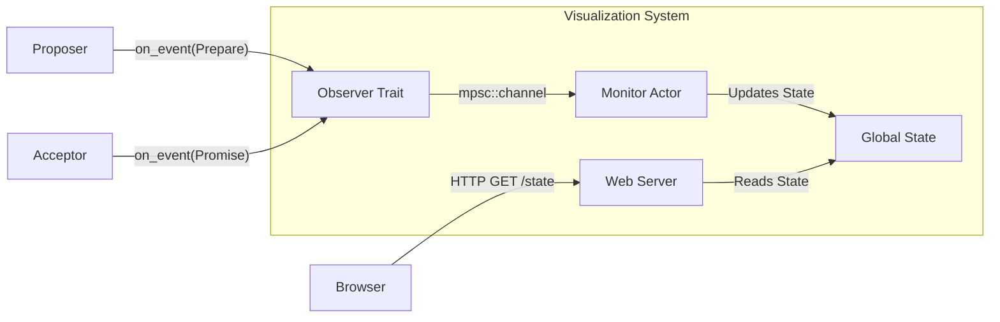

# Paxos Visualization Architecture

This document outlines how we will visualize the internal state of the Paxos nodes in real-time.

## 1. The Goal
We want to see the consensus process happening step-by-step.
*   **Proposer:** See it pick a ballot number, send prepares, receive promises, and choose a value.
*   **Acceptor:** See it update its `min_ballot` and `accepted_ballot`.
*   **Learner:** See it decide on a value.

## 2. High-Level Design
We will use the **Observer Pattern** combined with a **Shared State Container**.



## 3. Implementation Details

### A. The Observer Trait (`src/monitor.rs`)
We already have the stub for this. The trait allows components to be decoupled from the visualization logic.
```rust
pub trait PaxosObserver: Send + Sync {
    fn on_event(&self, event: Event);
}
```

### B. Instrumentation
We will inject `Arc<dyn PaxosObserver>` into our structs (`Proposer`, `Acceptor`).
*   **Before:** `fn new() -> Self`
*   **After:** `fn new(observer: Arc<dyn PaxosObserver>) -> Self`

### C. The Monitor Actor
A background task that:
1.  Receives `Event`s from a channel.
2.  Updates a `HashMap<NodeId, NodeState>`.
3.  Protects this state with a `RwLock`.

### D. The Poller Interface (Frontend)
A simple API endpoint returning JSON:
```json
{
  "nodes": {
    "acceptor_1": { "min_ballot": 5, "accepted_ballot": 2, "value": "Foo" },
    "proposer_1": { "current_ballot": 6, "state": "Phase1" }
  },
  "history": [
    { "time": 100, "msg": "Proposer 1 sent Prepare(6)" },
    { "time": 105, "msg": "Acceptor 1 promised Prepare(6)" }
  ]
}
```
The frontend will poll this every 500ms (or use Server-Sent Events).

## 4. Next Steps
1.  Refactor `Proposer` and `Acceptor` to accept the `observer` in their constructor.
2.  Identify where to insert `observer.on_event(...)` calls in the business logic.
3.  Build the simple `Monitor` struct.
